# PRD — MarketingOS: Learn by Doing
**Product Requirements Document v1.4 — Payment Manual Transfer**
**Tanggal:** 27 Juni 2026
**Dibuat oleh:** System Analyst / BA
**Status:** Revised — Ready for Development

---

## 📋 CHANGELOG

| Versi | Tanggal | Perubahan |
|-------|---------|-----------|
| v1.0 | 27 Jun 2026 | Initial draft |
| v1.1 | 27 Jun 2026 | AI Coach diganti dari Claude API ke Google Gemini API |
| v1.2 | 27 Jun 2026 | Post-Council Revision — 13 kritis + 20 minor dari 5 expert (BA, Architect, PM, Security, QA) |
| v1.3 | 27 Jun 2026 | Tambah Subscription Layer — FR-20 s/d FR-25, BR-07 s/d BR-11, NFR-09, ERD subscription tables, Midtrans integration |
| v1.4 | 27 Jun 2026 | Ganti payment gateway Midtrans ke manual bank transfer + upload bukti transfer. Update FR-21, FR-22, NFR-09, ERD, Integration Map, Tech Stack |

### Ringkasan Perubahan v1.4

| ID | Kategori | Perubahan yang Diterapkan |
|----|----------|--------------------------|
| PAY-01 | Kritis | Update FR-21: checkout = tampilkan info rekening bank, buat order, user transfer manual |
| PAY-02 | Kritis | Update FR-22: aktivasi subscription via upload bukti transfer + verifikasi admin |
| PAY-03 | Kritis | Tambah FR-26: upload bukti transfer (gambar) oleh user |
| PAY-04 | Kritis | Tambah FR-27: verifikasi manual oleh admin (approve/reject bukti transfer) |
| PAY-05 | Kritis | Update NFR-09: keamanan file upload menggantikan webhook security |
| PAY-06 | Minor | Update ERD: ganti `subscription_orders` (hapus snap_token, midtrans_tx_id, tambah `payment_proofs` table) |
| PAY-07 | Minor | Update Integration Map: hapus Midtrans, tambah Supabase Storage untuk bukti transfer |
| PAY-08 | Minor | Update Tech Stack: hapus Midtrans SDK, tambah file upload handling |
| PAY-09 | Minor | Update In-Scope v1.2: ubah deskripsi item 15 ke "Manual bank transfer + upload bukti" |

### Ringkasan Perubahan v1.3

| ID | Kategori | Perubahan yang Diterapkan |
|----|----------|--------------------------|
| SUB-01 | Kritis | Tambah FR-20: halaman pricing & pilihan plan |
| SUB-02 | Kritis | Tambah FR-21: checkout & pembayaran via Midtrans |
| SUB-03 | Kritis | Tambah FR-22: webhook handler Midtrans → aktivasi subscription |
| SUB-04 | Kritis | Tambah FR-23: gate konten Modul 6–19 berdasarkan plan |
| SUB-05 | Kritis | Tambah FR-24: trial PRO 7 hari untuk user baru |
| SUB-06 | Kritis | Tambah FR-25: manajemen subscription (lihat status, riwayat order) |
| SUB-07 | Kritis | Tambah BR-07 s/d BR-11: business rules subscription |
| SUB-08 | Kritis | Tambah NFR-09: keamanan payment & webhook |
| SUB-09 | Minor | Update ERD: tambah tabel `subscriptions` dan `subscription_orders` |
| SUB-10 | Minor | Update Integration Map: tambah Midtrans |
| SUB-11 | Minor | Update Tech Stack: tambah Midtrans SDK |
| SUB-12 | Minor | Update Appendix B: Business Model Hypothesis → konkret ke Freemium |
| SUB-13 | Minor | Update In-Scope v1.2: subscription sebagai fase tersendiri post-MVP |

### Ringkasan Perubahan v1.2

| ID Council | Kategori | Perubahan yang Diterapkan |
|------------|----------|--------------------------|
| BA-C01 | Kritis | Tambah FR-16: reset password flow |
| BA-C02 | Kritis | Definisi business rule modul selesai + acceptance criteria FR-05 |
| BA-C03 | Kritis | Tambah alternative flow email verifikasi expired di section 5.1 |
| BA-M01 | Minor | Definisi streak di Glossary diperjelas |
| BA-M02 | Minor | FR-07 ditambah constraint minimal 50 karakter |
| BA-M03 | Minor | Tambah trigger status "sedang dipelajari" di FR-03 |
| BA-M04 | Minor | Tambah stakeholder Admin di tabel |
| SA-C01 | Kritis | Sequence 7.1 direvisi: hapus direct insert Frontend→DB, ganti Supabase trigger |
| SA-C02 | Kritis | Tambah sequence diagram 7.5: Error Handling & Fallback |
| SA-C03 | Kritis | Tambah Gemini API key management strategy di section Integrasi |
| SA-M01 | Minor | Tambah catatan index wajib di ERD |
| SA-M02 | Minor | Tambah ISR caching strategy di Tech Stack |
| SA-M03 | Minor | Expand struktur folder lib/gemini/ |
| SA-M04 | Minor | Tambah migration strategy di roadmap |
| PM-C01 | Kritis | Tambah FR-17: guided onboarding 3-langkah |
| PM-C02 | Kritis | Tambah FR-18: re-engagement banner |
| PM-C03 | Kritis | Tambah section Business Model Hypothesis di appendix |
| PM-M01 | Minor | Definisi urutan modul: sequential M1-5, bebas M6-19 |
| PM-M02 | Minor | Tambah section MVP Success Criteria |
| PM-M03 | Minor | Tambah task image upload di v1.1 scope |
| PM-M04 | Minor | Tambah FR-19: bookmark modul |
| SEC-C01 | Kritis | Tambah NFR-08: rate limiting AI endpoint |
| SEC-C02 | Kritis | Sequence 7.1 direvisi: localStorage → HttpOnly Cookie |
| SEC-M01 | Minor | Tambah DOMPurify di NFR-03 |
| SEC-M02 | Minor | Tambah tabel audit_logs di ERD (post-MVP) |
| SEC-M03 | Minor | Tambah CSP header di NFR-03 |
| SEC-M04 | Minor | Tambah enkripsi at rest consideration di NFR-07 |
| QA-C01 | Kritis | Tambah kolom Acceptance Criteria untuk semua FR High |
| QA-C02 | Kritis | Definisi timezone WIB + DATE field untuk streak di Glossary |
| QA-M01 | Minor | Tambah section 5.4: Edge Cases & Error Scenarios |
| QA-M02 | Minor | FR-11 ditambah catatan trigger kalkulasi |
| QA-M03 | Minor | FR-05 ditambah note reading completion MVP |
| QA-M04 | Minor | FR-14 ditambah batas karakter + konteks prompt |

---

## 📋 DAFTAR ISI

1. [Executive Summary](#1-executive-summary)
2. [Asumsi & Scope](#2-asumsi--scope)
3. [Business Requirements (BRD)](#3-business-requirements-brd)
4. [Mindmap Aplikasi](#4-mindmap-aplikasi)
5. [General Flow Process](#5-general-flow-process)
6. [Use Case](#6-use-case)
7. [Sequence Diagram](#7-sequence-diagram)
8. [ERD / Data Model](#8-erd--data-model)
9. [Component Architecture](#9-component-architecture)
10. [Integration Map](#10-integration-map)
11. [Technical Stack Recommendation](#11-technical-stack-recommendation)
12. [Non-Functional Requirements](#12-non-functional-requirements)
13. [MVP Success Criteria](#13-mvp-success-criteria)
14. [Rekomendasi Langkah Selanjutnya](#14-rekomendasi-langkah-selanjutnya)
15. [Appendix](#15-appendix)

---

## 1. EXECUTIVE SUMMARY

**MarketingOS: Learn by Doing** adalah platform web interaktif yang membantu siapapun belajar marketing secara terstruktur — dari nol hingga mampu mengajarkannya ke orang lain. Platform ini dibangun di atas framework **19 poin sistem marketing** yang telah terbukti menghasilkan miliaran dolar penjualan, disampaikan dalam format belajar aktif: baca konsep → kerjakan task praktek → refleksi → ukur progress.

Berbeda dari platform kursus konvensional yang bersifat pasif (tonton video, hafal materi), MarketingOS dirancang sebagai **sistem eksekusi** — setiap konsep langsung diikuti aktivitas nyata yang bisa diaplikasikan ke bisnis pengguna. Platform ini dilengkapi **guided onboarding**, **streak-based retention mechanic**, dan **AI Coach** berbasis Google Gemini API untuk memberikan feedback kontekstual tanpa perlu menunggu instruktur manusia.

Target utama: pebisnis UMKM, fresh graduate marketing, dan individu yang ingin membangun karir atau bisnis berbasis kemampuan marketing.

---

## 2. ASUMSI & SCOPE

### Asumsi
- Pengguna memiliki akses internet dan browser modern (Chrome, Firefox, Safari terbaru)
- Konten 19 modul marketing ditulis secara manual oleh content creator (bukan generated AI)
- Bahasa antarmuka: Bahasa Indonesia
- MVP tidak memerlukan pembayaran/subscription — akses gratis untuk semua fitur dasar
- Fitur AI Coach menggunakan Google Gemini API (free tier: 15 RPM, 1 juta token/hari)
- Tidak ada kebutuhan real-time collaboration antar pengguna di MVP
- Deployment awal di Vercel + Supabase (managed, tidak perlu DevOps dedicated)
- **[NEW v1.2]** Timezone platform menggunakan WIB (UTC+7) sebagai default untuk semua kalkulasi tanggal
- **[NEW v1.2]** Modul 1–5 bersifat sequential (wajib berurutan). Modul 6–19 dapat diakses bebas setelah Modul 5 selesai

### In-Scope (MVP v1.0)

| No | Fitur |
|----|-------|
| 1 | Autentikasi pengguna (register, login, logout, reset password) |
| 2 | Guided onboarding 3-langkah setelah register pertama |
| 3 | 19 modul konten marketing dengan task praktek |
| 4 | Progress tracker per modul dan keseluruhan |
| 5 | Task submission teks (min. 50 karakter) |
| 6 | Daily log & streak counter (berbasis tanggal WIB) |
| 7 | Dashboard personal + re-engagement banner |
| 8 | Bookmark modul untuk review nanti |

### In-Scope (v1.1 — Post-MVP)

| No | Fitur |
|----|-------|
| 9 | AI Coach — feedback otomatis untuk task submission |
| 10 | AI Coach — tanya jawab kontekstual per modul (max 500 karakter input) |
| 11 | Quiz / kuis pemahaman per modul (3–5 soal) |
| 12 | Rekomendasi modul berikutnya berbasis progress |
| 13 | Task submission mendukung upload gambar/screenshot (max 5MB) |

### In-Scope (v1.2 — Subscription Layer)

> **[NEW v1.3]** Subscription diaktifkan setelah MVP success criteria terpenuhi (≥ 50 MAU, completion rate ≥ 3 modul). User existing saat launch tetap FREE (grandfather policy).

| No | Fitur |
|----|-------|
| 14 | Halaman pricing & perbandingan plan (FREE vs PRO vs LIFETIME) |
| 15 | **[UPDATE v1.4]** Checkout via manual bank transfer — user melihat nomor rekening dan melakukan transfer sendiri |
| 16 | **[UPDATE v1.4]** Upload bukti transfer (screenshot/foto) oleh user setelah transfer |
| 17 | **[UPDATE v1.4]** Verifikasi manual oleh admin, aktivasi subscription setelah bukti dikonfirmasi |
| 18 | Gate konten Modul 6–19 berdasarkan plan (FREE: hanya M1–5) |
| 19 | Trial PRO 7 hari gratis untuk user baru |
| 20 | Halaman manajemen subscription (status plan, riwayat pembayaran) |
| 21 | Grace period 24 jam setelah PRO expired sebelum akses dicabut |

### Out-of-Scope

- Komunitas / forum diskusi antar pengguna
- Sertifikat kelulusan
- ~~Sistem pembayaran / subscription~~ → **Dipindah ke In-Scope v1.2** (subscription layer)
- Mobile app (iOS/Android)
- Leaderboard / gamifikasi kompleks
- Video content / live streaming
- Multi-bahasa (selain Bahasa Indonesia)
- Notifikasi email / push notification eksternal
- Admin CMS untuk manajemen konten (konten dikelola via Supabase Studio di MVP)
- Audit log UI (tabel tersedia di DB, UI di post-MVP)

### Stakeholder

| Stakeholder | Role | Kepentingan |
|-------------|------|-------------|
| Product Owner (Vincent) | Builder & user pertama | Belajar marketing sambil membangun produk |
| Learner / Pelajar | End user utama | Belajar marketing terstruktur & terukur |
| Developer | Tim teknis | Membangun dan memelihara sistem |
| Content Creator | Penulis konten modul | Menyediakan materi 19 poin marketing |
| **[NEW]** Admin | Pengelola konten & monitoring | Kelola modul via Supabase Studio, pantau user di MVP |

---

## 3. BUSINESS REQUIREMENTS (BRD)

### Tujuan Bisnis

MarketingOS hadir untuk menyelesaikan masalah fragmentasi belajar marketing — di mana konten tersebar di berbagai platform tanpa struktur yang jelas, tidak ada mekanisme untuk mengukur pemahaman nyata, dan tidak ada panduan eksekusi langkah per langkah. Platform ini menciptakan nilai dengan menyatukan teori, praktek, dan pengukuran dalam satu sistem terpadu yang dapat diakses gratis.

### Business Rules

| ID | Rule | Keterangan |
|----|------|------------|
| BR-01 | Modul dapat ditandai selesai HANYA jika task sudah disubmit minimal 1 kali | Mencegah user skip konten tanpa mengerjakan |
| BR-02 | Status modul berubah ke "sedang dipelajari" saat user pertama kali membuka halaman modul | Trigger: page load pertama kali |
| BR-03 | Streak dihitung berdasarkan DATE field (bukan timestamp), timezone WIB (UTC+7) | Konsistensi kalkulasi lintas device |
| BR-04 | Modul 1–5 wajib diselesaikan secara berurutan sebelum mengakses Modul 6–19 | Prerequisite flow untuk pemula |
| BR-05 | Jawaban task minimal 50 karakter untuk dapat disubmit | Mencegah submission tidak bermakna |
| BR-06 | AI Coach endpoint dibatasi maksimal 10 request/user/jam | Rate limiting untuk mencegah abuse quota API |
| **BR-07** | **[NEW v1.3] User FREE hanya bisa mengakses Modul 1–5** | **Modul 6–19 menampilkan overlay upgrade, bukan pesan error** |
| **BR-08** | **[NEW v1.3] Sequential rule (BR-04) tetap berlaku meski sudah berlangganan PRO/LIFETIME** | **Subscription tidak skip prerequisite** |
| **BR-09** | **[NEW v1.3] Fitur AI Coach (FR-13, FR-14) eksklusif untuk plan PRO dan LIFETIME** | **User FREE melihat prompt upgrade, bukan error** |
| **BR-10** | **[NEW v1.3] Trial PRO 7 hari hanya untuk user yang pertama kali register setelah fitur subscription aktif** | **Satu kali per akun, tidak bisa diulang** |
| **BR-11** | **[NEW v1.3] Progress & submission tetap tersimpan saat PRO expired — tidak ada data yang hilang** | **User bisa lanjut dari titik yang sama jika subscribe lagi** |

### Functional Requirements

> **Kolom Acceptance Criteria ditambahkan sesuai rekomendasi QA Lead [QA-C01]**

| ID | Requirement | Prioritas | Acceptance Criteria | Catatan |
|----|-------------|-----------|---------------------|---------|
| FR-01 | Pengguna dapat mendaftar dengan email & password | High | ✅ Registrasi berhasil jika email valid (format RFC 5322), password min. 8 karakter. ✅ Error message spesifik jika email sudah terdaftar. ✅ Email verifikasi terkirim dalam 60 detik | Validasi email format + Supabase trigger buat user record |
| FR-02 | Pengguna dapat login dan mendapatkan session yang persisten | High | ✅ Login berhasil dengan kredensial benar → redirect ke dashboard. ✅ Session persisten selama 7 hari (cookie). ✅ Error "Email atau password salah" jika gagal (tidak spesifik mana yang salah) | HttpOnly Cookie, bukan localStorage |
| FR-03 | Pengguna dapat melihat daftar 19 modul beserta status | High | ✅ 19 modul tampil dalam urutan 1–19. ✅ Status modul terlihat: "belum dimulai" / "sedang dipelajari" / "selesai". ✅ Modul 6–19 terkunci (locked state) jika Modul 5 belum selesai | Status "sedang" otomatis update saat buka modul pertama kali |
| FR-04 | Pengguna dapat membaca konten tiap modul | High | ✅ Konten render sempurna di desktop (1280px) dan mobile (375px). ✅ Konten markdown tersanitasi via DOMPurify sebelum render. ✅ Load time halaman modul < 2 detik | Format rich text / markdown |
| FR-05 | Pengguna dapat menandai modul sebagai selesai | High | ✅ Tombol "Tandai Selesai" hanya aktif (enabled) jika task sudah disubmit minimal 1x. ✅ Status modul ter-update ke "selesai" secara real-time di daftar modul. ✅ Progress keseluruhan ter-update otomatis | Sesuai BR-01. MVP tidak validasi reading completion — user bisa submit task kapanpun setelah membuka modul |
| FR-06 | Pengguna dapat melihat task praktek per modul | High | ✅ Task tampil setelah user membuka halaman modul. ✅ Deskripsi task + panduan pengerjaan + rubrik penilaian tampil lengkap | 1 task per modul di MVP |
| FR-07 | Pengguna dapat submit jawaban task dalam bentuk teks | High | ✅ Tombol Submit aktif hanya jika input ≥ 50 karakter. ✅ Counter karakter realtime tampil di bawah textarea. ✅ Submission tersimpan ke DB dengan timestamp. ✅ Konfirmasi sukses tampil setelah submit | Min. 50 karakter (BR-05) |
| FR-08 | Pengguna dapat melihat riwayat submission task sebelumnya | Medium | ✅ List submission tampil diurutkan terbaru di atas. ✅ Setiap item menampilkan: tanggal, preview 100 karakter pertama jawaban | List per modul |
| FR-09 | Pengguna dapat melihat progress keseluruhan dalam bentuk persentase | High | ✅ Progress (%) = (jumlah modul berstatus "selesai" / 19) × 100, dibulatkan ke bilangan bulat. ✅ Progress bar visual ter-update real-time setelah modul ditandai selesai. ✅ Tampil di dashboard dan header halaman modul | Dashboard utama |
| FR-10 | Pengguna dapat melakukan daily log dengan catatan teks | Medium | ✅ Hanya 1 log per hari (DATE WIB). ✅ Jika sudah ada log hari ini, form menampilkan isi log yang bisa diedit. ✅ Simpan berhasil dalam < 1 detik | Satu log per hari per user |
| FR-11 | Sistem menghitung dan menampilkan streak belajar harian | Medium | ✅ Streak = jumlah hari berturut-turut berdasarkan DATE log (WIB). ✅ Streak dikalkulasi real-time saat user menyimpan daily log (bukan scheduled job). ✅ Jika tidak ada log kemarin, streak reset ke 1 (bukan 0) | Sesuai BR-03. Kalkulasi: cek apakah ada log pada DATE = today - 1 hari |
| FR-12 | Pengguna dapat melihat dashboard personal | High | ✅ Dashboard tampil: progress % keseluruhan, streak hari ini, modul terakhir diakses, 3 modul berikutnya yang direkomendasikan. ✅ Dashboard load < 2 detik | Landing page setelah login |
| FR-13 | (v1.1) AI Coach memberikan feedback otomatis untuk task yang disubmit | High | ✅ Feedback muncul dalam < 10 detik setelah submit. ✅ Jika Gemini API timeout (>10 detik), tampilkan pesan "Feedback AI sedang tidak tersedia, coba lagi nanti" tanpa menggagalkan submission. ✅ Feedback tersimpan di DB | Google Gemini API, dibatasi BR-06 |
| FR-14 | (v1.1) Pengguna dapat bertanya ke AI Coach dalam konteks modul aktif | High | ✅ Input maksimal 500 karakter (counter realtime). ✅ Sistem menyertakan: judul modul + 100 kata pertama konten modul sebagai konteks ke Gemini prompt. ✅ Respons AI muncul dalam < 10 detik | Chat interface per modul |
| FR-15 | (v1.1) Sistem menyajikan quiz 3–5 soal per modul | Medium | ✅ Quiz tampil setelah modul ditandai selesai. ✅ Skor tampil setelah semua soal dijawab. ✅ Penjelasan jawaban benar tampil untuk setiap soal | Pilihan ganda |
| FR-16 | **[NEW]** Pengguna dapat mereset password melalui email | High | ✅ Link reset dikirim ke email terdaftar dalam < 60 detik. ✅ Link reset expired setelah 24 jam. ✅ Halaman reset password memvalidasi password baru min. 8 karakter. ✅ Setelah reset berhasil, semua session aktif di-invalidate | Sesuai BA-C01 |
| FR-17 | **[NEW]** Guided onboarding 3-langkah setelah register pertama | High | ✅ Onboarding hanya muncul SEKALI saat login pertama kali (flag `onboarding_completed` di DB). ✅ 3 langkah: (1) pilih tujuan belajar, (2) estimasi waktu per hari, (3) otomatis arahkan ke Modul 1. ✅ Data tujuan & estimasi waktu tersimpan di profil user | Sesuai PM-C01 |
| FR-18 | **[NEW]** Re-engagement banner setelah tidak aktif >2 hari | Medium | ✅ Banner "Selamat datang kembali! Lanjutkan [nama modul terakhir]" tampil di dashboard jika last_active_at > 2 hari yang lalu. ✅ Banner bisa di-dismiss (close). ✅ Klik banner → redirect ke modul terakhir diakses | Sesuai PM-C02. In-app, tidak butuh push notification |
| FR-19 | **[NEW]** Pengguna dapat mem-bookmark modul untuk direview nanti | Low | ✅ Ikon bookmark di setiap modul card. ✅ Halaman "Modul Tersimpan" menampilkan semua modul yang di-bookmark. ✅ Bookmark bisa di-toggle (on/off) | Sesuai PM-M04 |
| FR-20 | **[NEW v1.3]** Pengguna dapat melihat halaman pricing & perbandingan plan | High | ✅ Tabel perbandingan FREE vs PRO vs LIFETIME tampil jelas. ✅ Harga PRO (Rp 99.000/bln) dan LIFETIME (Rp 399.000) tercantum. ✅ Fitur yang didapat tiap plan ditampilkan per baris. ✅ Tombol CTA per plan ("Mulai Trial" / "Berlangganan" / "Beli Sekarang") | Halaman `/pricing`. Aktif setelah MVP success criteria terpenuhi |
| FR-21 | **[UPDATE v1.4]** Pengguna dapat melakukan checkout via manual bank transfer | High | ✅ Klik CTA → halaman checkout menampilkan: nomor rekening tujuan, nama bank, nama pemilik rekening, nominal transfer sesuai plan. ✅ Order dibuat di DB dengan status `pending_payment`. ✅ Panduan transfer tampil jelas (langkah 1-3). ✅ User mendapat batas waktu konfirmasi 24 jam | Tidak ada Midtrans/payment gateway. Transfer langsung ke rekening admin |
| FR-22 | **[UPDATE v1.4]** Pengguna dapat mengupload bukti transfer setelah melakukan pembayaran | High | ✅ Halaman upload bukti transfer tersedia setelah order dibuat. ✅ Mendukung format: JPG, PNG, PDF (maks 5MB). ✅ Preview gambar sebelum upload. ✅ Setelah upload → status order berubah ke `waiting_verification`. ✅ Konfirmasi sukses upload tampil + estimasi waktu verifikasi (1×24 jam) | Supabase Storage bucket `payment-proofs`. Order ID wajib dalam nama file |
| **FR-26** | **[NEW v1.4]** Admin dapat memverifikasi bukti transfer dan mengaktifkan subscription | High | ✅ Admin melihat daftar order dengan status `waiting_verification`. ✅ Admin bisa lihat gambar bukti transfer. ✅ Admin klik Approve → subscription otomatis aktif, user mendapat notifikasi via toast saat login. ✅ Admin klik Reject → order ditolak, user mendapat info alasan. ✅ Riwayat verifikasi tersimpan (verified_by, verified_at) | Akses admin via Supabase Studio atau halaman admin sederhana (post-MVP) |
| **FR-27** | **[NEW v1.4]** User mendapat konfirmasi aktivasi subscription | Medium | ✅ Setelah admin approve → `current_plan` user terupdate. ✅ User melihat toast "Subscription PRO kamu sudah aktif!" saat membuka aplikasi. ✅ Status order di halaman `/settings/subscription` berubah dari "Menunggu Verifikasi" ke "Aktif" | Polling status via GET /api/subscription tiap kunjungan halaman subscription |
| FR-23 | **[NEW v1.3]** Konten Modul 6–19 di-gate berdasarkan plan subscription | High | ✅ User FREE: ModuleCard modul 6–19 tampil overlay "PRO" + tombol "Upgrade". ✅ User PRO/LIFETIME/Trial: akses normal. ✅ User PRO expired: modul 6–19 kembali terkunci, progress tidak hilang. ✅ Pesan upgrade ramah, bukan pesan error | Sesuai BR-07 & BR-11 |
| FR-24 | **[NEW v1.3]** User baru mendapatkan trial PRO 7 hari secara otomatis | Medium | ✅ Trial diaktifkan otomatis saat register pertama (setelah fitur subscription live). ✅ Banner countdown "X hari tersisa" tampil di dashboard. ✅ H-1 trial habis: banner lebih mencolok + CTA subscribe. ✅ Setelah 7 hari tanpa subscribe → downgrade ke FREE, progress tetap | Satu kali per akun. Sesuai BR-10 |
| FR-25 | **[NEW v1.3]** Pengguna dapat melihat dan mengelola status subscription | Medium | ✅ Halaman `/settings/subscription` menampilkan: plan aktif, tanggal renewal/expired, riwayat pembayaran. ✅ Tombol "Perpanjang" jika PRO hampir expired (< 7 hari). ✅ **[UPDATE v1.4]** Riwayat order menampilkan: tanggal order, plan, nominal, status (Menunggu Transfer / Menunggu Verifikasi / Aktif / Ditolak). ✅ User bisa upload ulang bukti jika order ditolak | Halaman pengaturan subscription |

### Non-Functional Requirements

> **[SA-M02, SEC-M01, SEC-M03, SEC-C01 ditambahkan di v1.2]**

| ID | Requirement | Metrik |
|----|-------------|--------|
| NFR-01 | Performance | Halaman load < 2 detik (LCP). API response < 500ms (P95). Halaman modul pakai ISR revalidate 3600 detik |
| NFR-02 | Availability | 99.5% uptime (Vercel SLA) |
| NFR-03 | Security | HTTPS only. JWT via HttpOnly Cookie (bukan localStorage). Input sanitasi via Zod (server) + DOMPurify (client). CSP header via `next.config.js`. OWASP Top 10 compliance |
| NFR-04 | Scalability | Mendukung hingga 1.000 MAU di MVP tanpa perubahan arsitektur |
| NFR-05 | Usability | Mobile-responsive (min. 375px viewport). WCAG AA dasar |
| NFR-06 | Maintainability | Kode modular, dokumentasi inline, TypeScript strict mode. Semua perubahan schema via Supabase migration file (tidak manual via Studio) |
| NFR-07 | Data Privacy | Password di-hash (bcrypt via Supabase Auth). Data user tidak dijual/dibagikan ke pihak ketiga. Pertimbangkan enkripsi kolom `task_submissions.content` via pgcrypto di v2 |
| **NFR-08** | **[NEW] AI Rate Limiting** | **Endpoint `/api/ai/feedback` dan `/api/ai/chat` dibatasi 10 request/user/jam via Vercel Edge Middleware. Counter disimpan di Supabase (tabel `ai_usage_log`). Response 429 dengan pesan "Batas harian tercapai, coba lagi dalam X menit"** |
| **NFR-09** | **[UPDATE v1.4] Payment & File Upload Security** | **File upload wajib divalidasi: tipe file (JPG/PNG/PDF only via MIME check), ukuran maks 5MB, nama file di-sanitasi sebelum disimpan. Supabase Storage bucket `payment-proofs` bersifat private (tidak bisa diakses publik tanpa signed URL). Aktivasi subscription hanya boleh dilakukan server-side dengan role admin — tidak ada endpoint publik untuk self-activate. Order ID unik per transaksi (format: `MOS-{timestamp}-{prefix}`). Idempotent: order yang sudah berstatus `paid`/`active` tidak bisa di-approve ulang** |

### Assumptions & Constraints

**Asumsi:**
- Pengguna mengakses dari perangkat dengan koneksi internet stabil
- Konten 19 modul sudah tersedia sebelum launch
- 1 developer fullstack mengerjakan MVP

**Constraints:**
- Budget infrastruktur: zero cost di awal (Vercel free tier + Supabase free tier)
- Waktu pengerjaan MVP: maksimal 6 minggu
- Tidak ada dedicated DevOps di tahap awal

**Dependencies:**
- Google Gemini API (free tier) untuk fitur AI Coach di v1.1
- Supabase Auth untuk sistem autentikasi (cookie-based session)
- Supabase Storage untuk penyimpanan bukti transfer (bucket `payment-proofs`)
- Vercel untuk hosting dan deployment otomatis
- **[UPDATE v1.4]** Tidak ada payment gateway eksternal — pembayaran manual via transfer bank, verifikasi oleh admin

---

## 4. MINDMAP APLIKASI

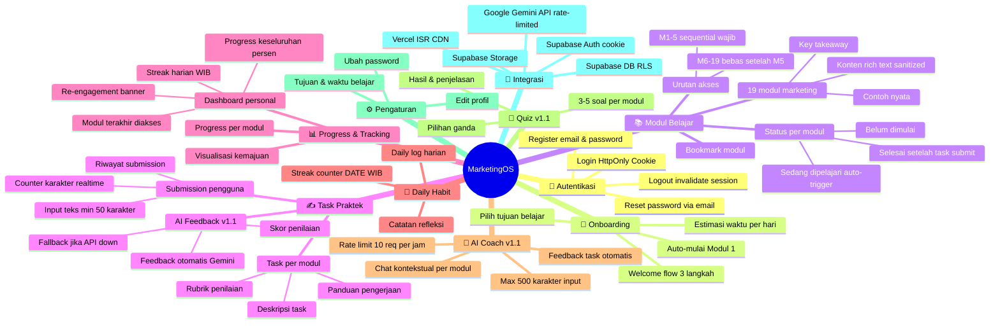

---

## 5. GENERAL FLOW PROCESS

### 5.1 Alur Onboarding Pengguna Baru

> **[v1.2] Ditambahkan: alternative flow email expired (BA-C03) dan guided onboarding (PM-C01)**

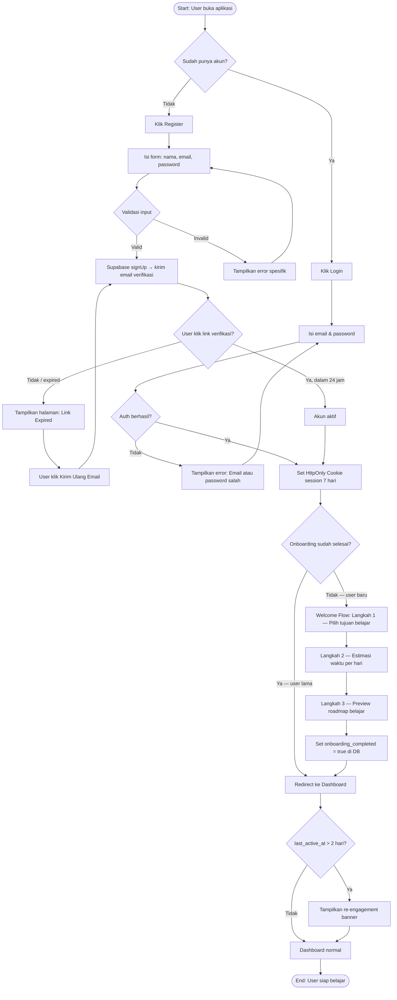

### 5.2 Alur Belajar Per Modul

> **[v1.2] Ditambahkan: cek prerequisite M1-5, business rule modul selesai (BA-C02), AI fallback**

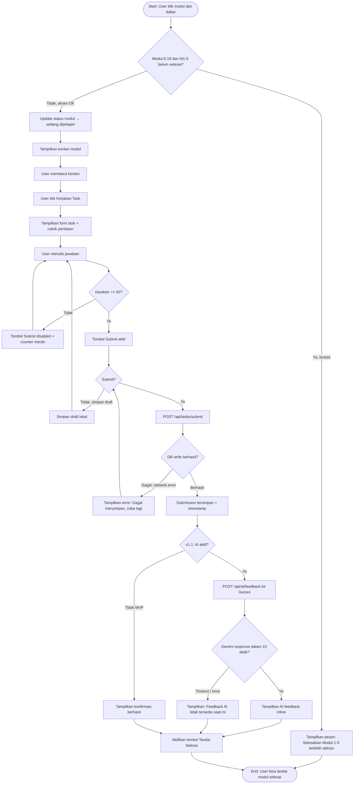

### 5.3 Alur Daily Log & Streak

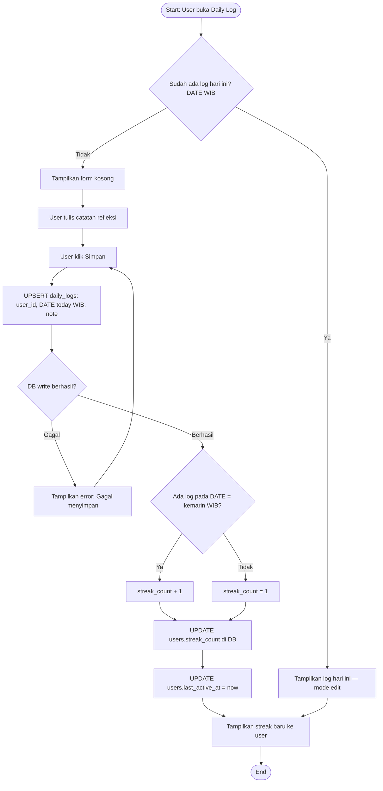

### 5.4 Edge Cases & Error Scenarios

> **[NEW v1.2] Ditambahkan sesuai rekomendasi QA Lead [QA-M01]**

```mermaid
flowchart TD
    subgraph ERR1["Skenario 1: Koneksi Terputus Saat Submit Task"]
        A1[User klik Submit] --> B1[Network request gagal]
        B1 --> C1[Tampilkan: Tidak ada koneksi internet]
        C1 --> D1[Draft jawaban tetap tersimpan di form]
        D1 --> E1[User reconnect → bisa submit ulang]
    end

    subgraph ERR2["Skenario 2: Gemini API Down / Timeout"]
        A2[Task berhasil disimpan ke DB] --> B2[POST ke Gemini API]
        B2 --> C2{Response dalam 10 detik?}
        C2 -->|Timeout| D2[Log error ke server]
        D2 --> E2[Tampilkan: AI feedback tidak tersedia saat ini]
        E2 --> F2[Submission tetap valid, modul bisa ditandai selesai]
        C2 -->|Error 5xx| D2
    end

    subgraph ERR3["Skenario 3: Rate Limit AI Tercapai"]
        A3[User kirim request AI ke-11 dalam 1 jam] --> B3[Edge Middleware cek counter]
        B3 --> C3[Counter >= 10]
        C3 --> D3[Return HTTP 429]
        D3 --> E3[Tampilkan: Batas penggunaan AI tercapai, coba lagi dalam X menit]
    end

    subgraph ERR4["Skenario 4: Email Verifikasi Expired"]
        A4[User klik link expired > 24 jam] --> B4[Supabase return error: expired]
        B4 --> C4[Tampilkan halaman: Link kadaluarsa]
        C4 --> D4[Tombol: Kirim Ulang Email Verifikasi]
        D4 --> E4[Supabase resend verification email]
    end
```

---

## 6. USE CASE

### 6.1 Daftar Use Case

| ID | Use Case | Aktor | Deskripsi | Prioritas |
|----|----------|-------|-----------|-----------|
| UC-01 | Register akun | Guest | Pengguna baru mendaftar dengan email & password | High |
| UC-02 | Login | Guest | Pengguna login, session via HttpOnly Cookie | High |
| UC-03 | Logout | User | Pengguna mengakhiri sesi, cookie di-invalidate | High |
| UC-04 | Reset password | Guest/User | Minta link reset via email, set password baru | High |
| UC-05 | Selesaikan guided onboarding | User Baru | Pilih tujuan, estimasi waktu, mulai Modul 1 | High |
| UC-06 | Lihat daftar modul | User | Melihat 19 modul beserta status dan lock state | High |
| UC-07 | Baca konten modul | User | Membaca materi marketing pada modul | High |
| UC-08 | Tandai modul selesai | User | Ubah status ke completed (hanya setelah task submit) | High |
| UC-09 | Lihat task praktek | User | Melihat task, panduan, dan rubrik modul | High |
| UC-10 | Submit jawaban task | User | Tulis min. 50 karakter, submit ke DB | High |
| UC-11 | Lihat riwayat submission | User | List jawaban task yang pernah disubmit | Medium |
| UC-12 | Lihat dashboard progress | User | Progress %, streak, re-engagement banner | High |
| UC-13 | Buat daily log | User | Menulis catatan refleksi harian | Medium |
| UC-14 | Lihat streak belajar | User | Melihat jumlah hari berturut-turut | Medium |
| UC-15 | Bookmark modul | User | Tandai modul untuk direview nanti | Low |
| UC-16 | Edit profil | User | Ubah nama, foto, tujuan belajar | Low |
| UC-17 | (v1.1) Tanya AI Coach | User | Input max 500 karakter, konteks modul aktif | High |
| UC-18 | (v1.1) Terima AI feedback | User | Feedback otomatis untuk task yang disubmit | High |
| UC-19 | (v1.1) Kerjakan quiz | User | 3–5 soal pilihan ganda per modul | Medium |

### 6.2 Use Case Diagram

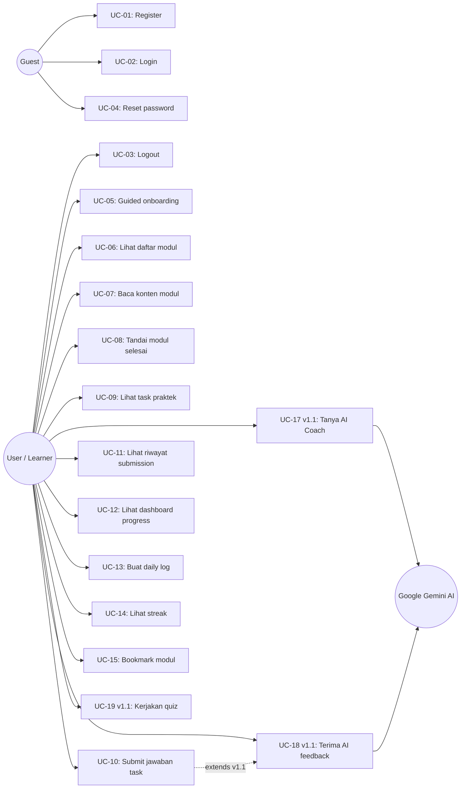

---

## 7. SEQUENCE DIAGRAM

### 7.1 Sequence: Register & Login

> **[v1.2] Direvisi: hapus direct insert Frontend→DB (SA-C01), ganti dengan Supabase Trigger. JWT disimpan di HttpOnly Cookie bukan localStorage (SEC-C02)**

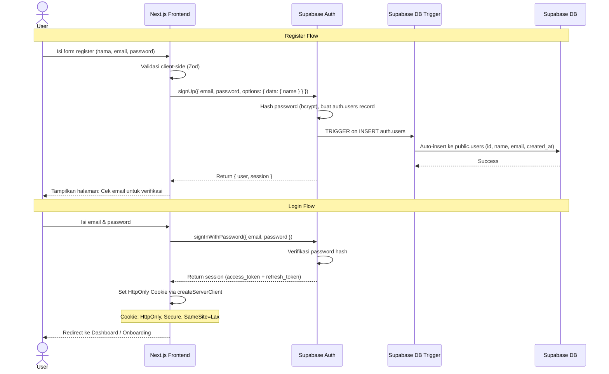

### 7.2 Sequence: Baca Modul & Submit Task

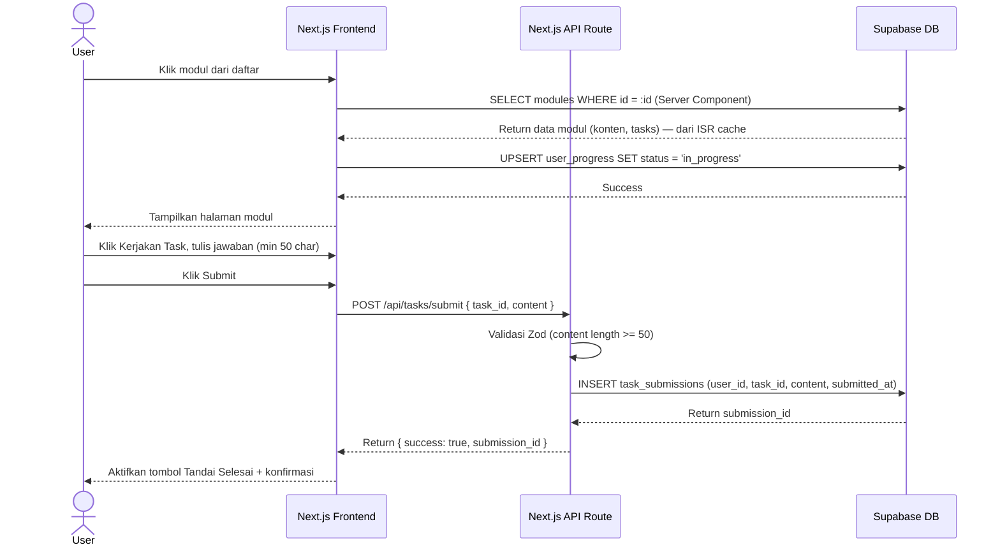

### 7.3 Sequence: AI Coach Feedback (v1.1)

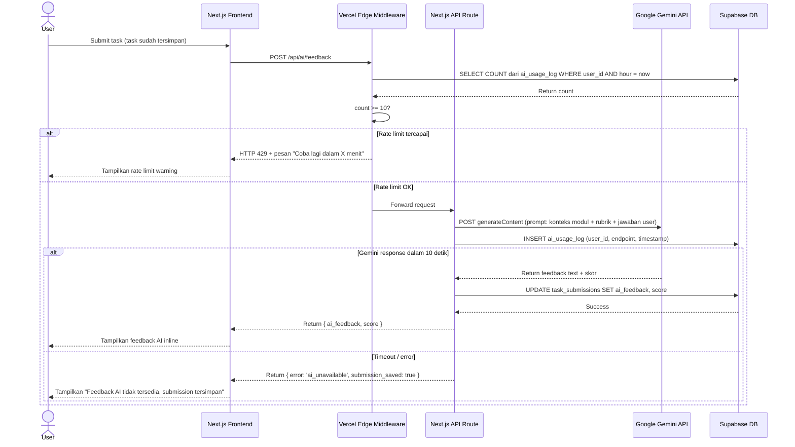

### 7.4 Sequence: Daily Log & Streak

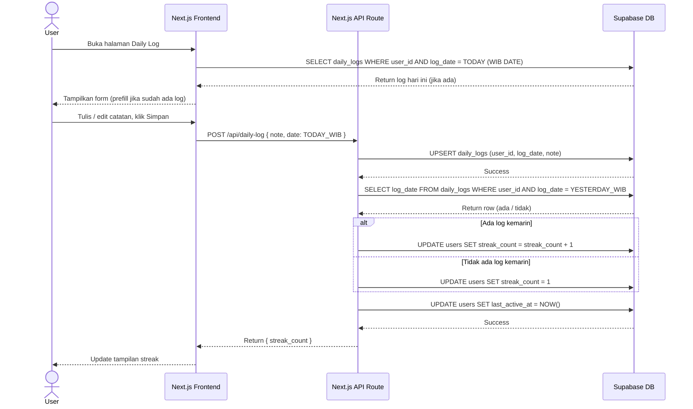

### 7.5 Sequence: Error Handling & Fallback

> **[NEW v1.2] Ditambahkan sesuai rekomendasi Architect [SA-C02]**

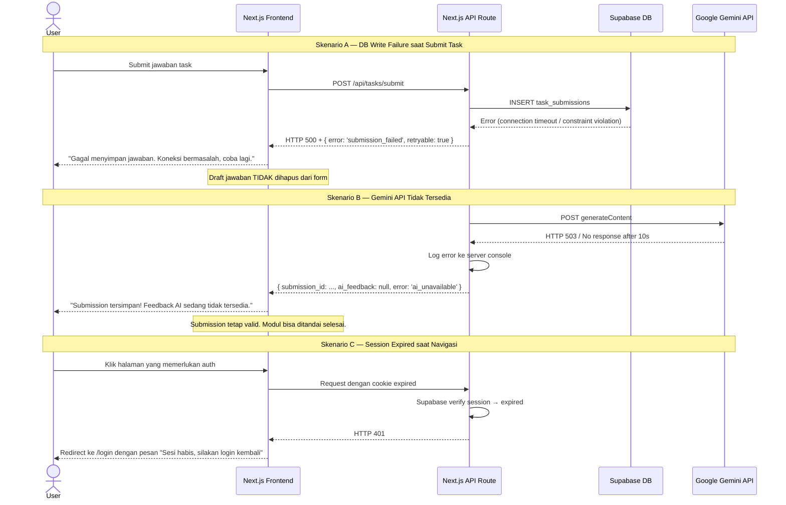

---

## 8. ERD / DATA MODEL

> **[v1.3] Ditambahkan: tabel `subscriptions` dan `subscription_orders`, kolom `current_plan` di `users` (SUB-09)**
> **[v1.2] Ditambahkan: tabel `onboarding_data`, `module_bookmarks`, `ai_usage_log`, `audit_logs` (post-MVP). Catatan index wajib ditambahkan (SA-M01)**

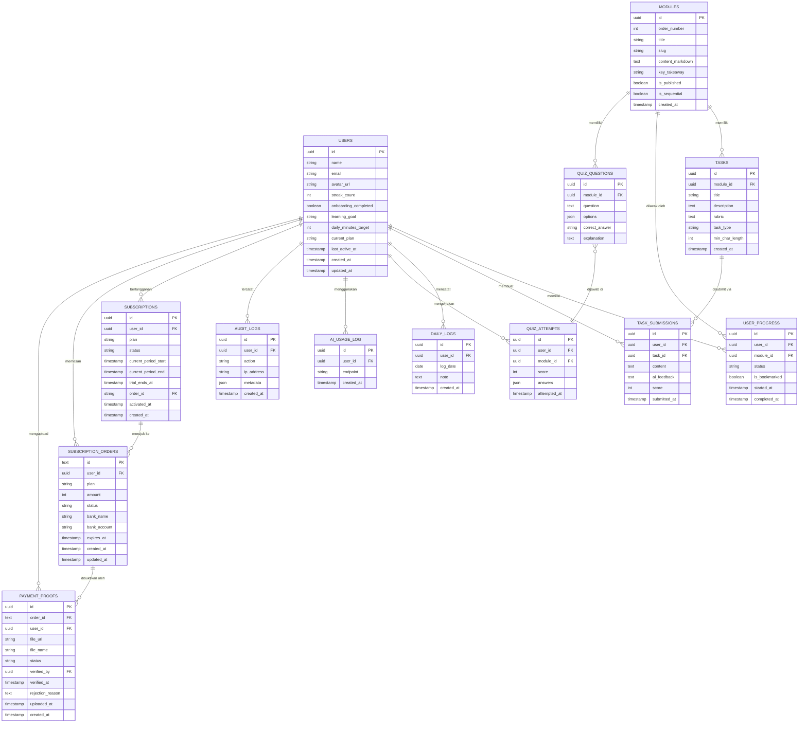

### Index Wajib

> **[NEW v1.2] Sesuai rekomendasi Architect [SA-M01]**

| Tabel | Index | Alasan |
|-------|-------|--------|
| `user_progress` | `(user_id, module_id)` | Query terbanyak: cek status modul per user |
| `task_submissions` | `(user_id, task_id)` | Query riwayat submission per user per task |
| `daily_logs` | `(user_id, log_date)` | Query streak: cek log kemarin |
| `ai_usage_log` | `(user_id, created_at)` | Rate limiting: COUNT dalam 1 jam terakhir |
| `audit_logs` | `(user_id, created_at)` | Query audit trail per user |
| **`subscriptions`** | **`(user_id, created_at DESC)`** | **Query status subscription aktif per user** |
| **`subscriptions`** | **`(status, current_period_end)`** | **Deteksi subscription expired** |
| **`subscription_orders`** | **`(user_id, created_at DESC)`** | **Riwayat pembayaran per user** |
| **`payment_proofs`** | **`(order_id)`** | **[NEW v1.4] Cari bukti transfer per order** |
| **`payment_proofs`** | **`(status, uploaded_at DESC)`** | **[NEW v1.4] Antrian verifikasi admin** |

---

## 9. COMPONENT ARCHITECTURE

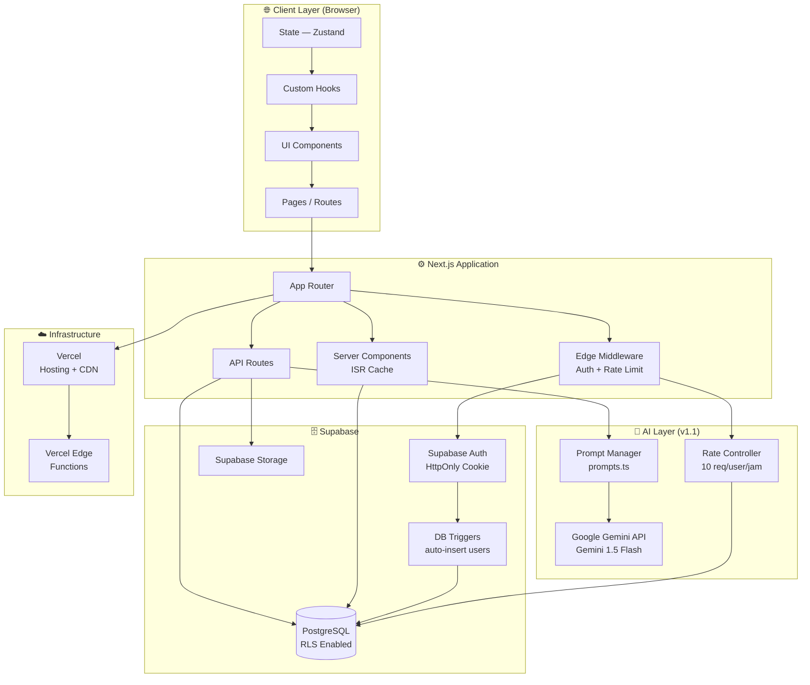

### Struktur Folder Next.js

> **[v1.2] Folder `lib/gemini/` diexpand (SA-M03), folder `onboarding/` dan `bookmarks/` ditambahkan**

```
marketingos/
├── app/
│   ├── (auth)/
│   │   ├── login/page.tsx
│   │   ├── register/page.tsx
│   │   └── reset-password/page.tsx       # [NEW] FR-16
│   ├── (onboarding)/
│   │   └── welcome/page.tsx              # [NEW] FR-17 guided onboarding
│   ├── (dashboard)/
│   │   ├── dashboard/page.tsx
│   │   ├── modules/
│   │   │   ├── page.tsx
│   │   │   └── [slug]/page.tsx
│   │   ├── tasks/[id]/page.tsx
│   │   ├── daily-log/page.tsx
│   │   └── bookmarks/page.tsx            # [NEW] FR-19
│   ├── api/
│   │   ├── auth/[...supabase]/route.ts
│   │   ├── progress/route.ts
│   │   ├── tasks/submit/route.ts
│   │   ├── daily-log/route.ts
│   │   ├── bookmarks/route.ts            # [NEW]
│   │   └── ai/
│   │       ├── feedback/route.ts         # v1.1
│   │       └── chat/route.ts             # v1.1
│   └── layout.tsx
├── components/
│   ├── ui/
│   ├── onboarding/                       # [NEW] welcome flow components
│   ├── modules/
│   ├── dashboard/
│   │   └── ReEngagementBanner.tsx        # [NEW] FR-18
│   └── ai-coach/                         # v1.1
├── lib/
│   ├── supabase/
│   │   ├── client.ts
│   │   └── server.ts
│   ├── gemini/
│   │   ├── client.ts                     # [EXPANDED] SA-M03
│   │   ├── prompts.ts                    # [NEW] template prompt per use case
│   │   └── types.ts                      # [NEW] type definitions
│   └── utils/
├── middleware.ts                          # Edge Middleware: auth + rate limit
├── hooks/
├── types/
└── supabase/
    └── migrations/                       # [PENTING] semua schema change via file ini
```

---

## 10. INTEGRATION MAP

> **[v1.2] Ditambahkan: Gemini API key management strategy (SA-C03)**

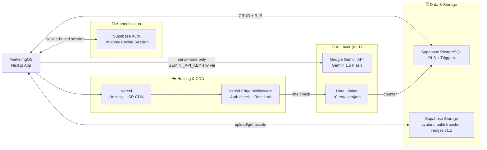

### Detail Integrasi

| Sistem | Tujuan | Metode | Catatan |
|--------|--------|--------|---------|
| **Supabase Auth** | Autentikasi user | Supabase JS SDK (`createServerClient`) | Cookie-based session (HttpOnly). Trigger auto-create `public.users` |
| **Supabase PostgreSQL** | Simpan semua data | Supabase JS SDK / REST | RLS enabled semua tabel. Index wajib pada tabel kritis |
| **Supabase Storage** | Avatar + bukti transfer + gambar task (v1.1) | Supabase Storage SDK | Bucket: `avatars`, `payment-proofs`, `task-images`. Bucket `payment-proofs` bersifat **private** — akses via signed URL only |
| **Google Gemini API** | AI feedback & coaching | `@google/generative-ai` SDK | **API key HANYA di server-side env var** (`GEMINI_API_KEY`). Tidak pernah expose ke client. Rate limit 10 req/user/jam via Edge Middleware |
| **Vercel** | Hosting, CDN, Edge Functions | GitHub integration | Auto-deploy on merge ke `main`. ISR untuk halaman modul |
| **Vercel Analytics** | Usage tracking | Script tag | Gratis di Vercel |
| **[UPDATE v1.4] Manual Bank Transfer** | Pembayaran subscription | Tidak ada SDK — transfer bank + upload bukti | User transfer ke rekening admin, upload screenshot bukti. Admin verifikasi manual via Supabase Studio atau halaman admin sederhana. **Tidak ada payment gateway eksternal** |

### Gemini API Key Management

> **[NEW v1.2] Sesuai rekomendasi Architect [SA-C03]**

```
# .env.local (TIDAK di-commit ke git)
GEMINI_API_KEY=your_key_here

# Penggunaan HANYA di server-side:
# app/api/ai/feedback/route.ts
# app/api/ai/chat/route.ts

# DILARANG di:
# app/*/page.tsx (client component)
# lib/gemini/client.ts jika diimport di client
```

**Rotasi API Key:** Dilakukan manual setiap 90 hari atau segera jika terindikasi kebocoran.
**Monitoring:** Pantau usage di Google AI Studio dashboard. Alert jika harian > 80% free tier limit.

---

## 11. TECHNICAL STACK RECOMMENDATION

### Recommended Stack

**Frontend**
- Framework: **Next.js 14** (App Router, Server Components)
- Language: **TypeScript** (strict mode)
- Styling: **Tailwind CSS** + **shadcn/ui**
- State: **Zustand** (lightweight, no boilerplate)
- Form: **React Hook Form** + **Zod** (validasi schema client + server)
- Sanitasi: **DOMPurify** (sanitasi konten modul sebelum render)

**Backend**
- Runtime: **Next.js API Routes** (tidak perlu server terpisah di MVP)
- Auth: **Supabase Auth** dengan **cookie-based session** via `createServerClient`
- ORM: **Supabase JS SDK** (type-safe queries)
- Edge: **Vercel Edge Middleware** (auth guard + rate limiting)

**Database**
- Primary: **PostgreSQL** via **Supabase** (managed, free tier 500MB)
- Schema Management: **Supabase Migrations** (wajib via file, tidak manual Studio)
- Cache: **ISR Next.js** untuk halaman modul (revalidate 3600 detik)

**AI Layer (v1.1)**
- Model: **Gemini 1.5 Flash** (Google AI) — free tier 15 RPM / 1M token/hari
- SDK: **`@google/generative-ai`** (Google AI JS SDK)
- Endpoint: `https://generativelanguage.googleapis.com/v1/models/gemini-1.5-flash:generateContent`
- Key: Server-side environment variable only

**Infrastructure**
- Hosting: **Vercel** (auto-deploy, edge network, free tier)
- Database: **Supabase** (managed PostgreSQL, free tier)
- CI/CD: **GitHub Actions** (lint + type-check + deploy on PR merge)

**Development Tools**
- Version Control: **GitHub**
- Package Manager: **pnpm**
- Linting: **ESLint** + **Prettier**
- Testing: **Vitest** (unit) + **Playwright** (e2e, opsional MVP)

### Alasan Pemilihan Stack

| Keputusan | Alasan |
|-----------|--------|
| Next.js vs plain React | Server Components + API Routes dalam satu project, lebih efisien untuk 1 developer |
| Cookie-based session vs localStorage | HttpOnly Cookie tidak bisa diakses JavaScript — immune terhadap XSS attack |
| Supabase trigger vs frontend insert | DB trigger lebih aman, tidak bisa di-bypass dari client, single responsibility |
| ISR untuk modul vs SSR | Konten modul jarang berubah — ISR cache di CDN mengurangi DB hit dan meningkatkan performa |
| Gemini 1.5 Flash vs GPT-3.5 / Claude Haiku | Free tier generous (15 RPM, 1M token/hari), performa baik untuk feedback teks, SDK sederhana |
| Vercel Edge Middleware untuk rate limit | Zero infrastructure, runs at edge, latency < 5ms sebelum request sampai API |
| Supabase migrations vs manual Studio | Reproducible, version-controlled, aman untuk rollback |
| **[UPDATE v1.4] Manual transfer vs Payment gateway** | **Manual bank transfer dipilih untuk MVP subscription: zero setup cost (tidak perlu merchant account, tidak ada fee transaksi dari gateway), cocok untuk volume rendah di awal. Trade-off: verifikasi tidak instan (1–24 jam), butuh effort admin. Dapat diganti ke Midtrans/Xendit saat volume meningkat** |

---

## 12. NON-FUNCTIONAL REQUIREMENTS

### Performa

| Metrik | Target | Cara Ukur |
|--------|--------|-----------|
| Largest Contentful Paint (LCP) | < 2.5 detik | Vercel Analytics / Lighthouse |
| API Response Time (P95) | < 500ms | Vercel Function logs |
| Time to First Byte (TTFB) | < 800ms | Lighthouse |
| Bundle Size (JS) | < 200KB gzipped | `next build` output |
| Halaman modul (ISR cache hit) | < 100ms TTFB | Vercel Analytics |

### Keamanan

- **Authentication**: Cookie-based session via Supabase Auth `createServerClient`. HttpOnly, Secure, SameSite=Lax
- **Authorization**: Row Level Security (RLS) di semua tabel Supabase
- **Input Validation**: Zod schema validation di client + server (double validation)
- **XSS Prevention**: DOMPurify untuk sanitasi konten modul. CSP header via `next.config.js`
- **SQL Injection**: Tidak mungkin via Supabase SDK (parameterized queries)
- **Rate Limiting**: Vercel Edge Middleware untuk `/api/ai/*` — 10 req/user/jam
- **HTTPS**: Enforced by Vercel (auto SSL)
- **Env Variables**: `GEMINI_API_KEY` dan semua secret di `.env.local`, tidak pernah di-commit
- **Session Invalidation**: Reset password akan invalidate semua session aktif

### Skalabilitas

- Arsitektur serverless (Vercel Functions) — auto-scale tanpa konfigurasi
- Supabase PostgreSQL mendukung connection pooling
- ISR caching untuk halaman modul — mengurangi DB load signifikan
- Estimasi kapasitas MVP: 1.000 MAU dengan free tier tanpa biaya tambahan

---

## 13. MVP SUCCESS CRITERIA

> **[NEW v1.2] Ditambahkan sesuai rekomendasi PM [PM-M02]**

MVP dinyatakan berhasil dan layak dilanjutkan ke v1.1 jika dalam **30 hari pertama setelah launch** memenuhi minimal 2 dari 3 kriteria berikut:

| # | Metrik | Target | Cara Ukur |
|---|--------|--------|-----------|
| 1 | Pengguna aktif (MAU) | ≥ 50 user terdaftar & login minimal 1x | Supabase Auth dashboard |
| 2 | Modul completion rate | Rata-rata user menyelesaikan ≥ 3 modul | Query: AVG(COUNT modul selesai per user) |
| 3 | Streak retention | Rata-rata streak ≥ 5 hari untuk user aktif | Query: AVG(streak_count) WHERE last_active_at > 7 hari |

**Sinyal pivot (perlu evaluasi ulang):**
- < 10 user aktif dalam 30 hari → masalah akuisisi / onboarding
- Completion rate < 1 modul/user → masalah konten / UX
- Streak rata-rata < 2 hari → masalah retention mechanic

---

## 14. REKOMENDASI LANGKAH SELANJUTNYA

### Segera (Minggu 1–2): Setup & Auth

| No | Aksi | PIC | Catatan |
|----|------|-----|---------|
| 1 | Setup repository GitHub + struktur Next.js project | Developer | Jalankan `pnpm create next-app` dengan TypeScript + Tailwind |
| 2 | Setup Supabase project + jalankan migration script semua tabel | Developer | **Wajib pakai file migration, bukan manual Studio** |
| 3 | Buat Supabase DB Trigger: `on INSERT auth.users → insert public.users` | Developer | Menggantikan direct insert dari frontend |
| 4 | Implementasi auth: register, login, logout dengan HttpOnly Cookie | Developer | Gunakan `createServerClient` dari `@supabase/ssr` |
| 5 | Implementasi reset password flow (FR-16) | Developer | Supabase sudah support `resetPasswordForEmail()` |
| 6 | Setup Vercel Edge Middleware untuk auth guard | Developer | Protect semua route `/(dashboard)/*` |

### Minggu 3–4: Core Learning

| No | Aksi | PIC | Catatan |
|----|------|-----|---------|
| 7 | Guided onboarding 3-langkah (FR-17) | Developer | Flag `onboarding_completed` di DB |
| 8 | Halaman daftar modul + lock state M6-19 | Developer | Sequential prerequisite sesuai BR-04 |
| 9 | Halaman detail modul dengan ISR | Developer | `revalidate: 3600` di Server Component |
| 10 | Form task submission dengan validasi 50 karakter | Developer | Counter karakter realtime |
| 11 | Business rule: tombol selesai hanya aktif setelah task submit | Developer | Sesuai BR-01 |
| 12 | Mulai tulis konten 19 modul (minimal 5 modul pertama) | Content Creator | Format markdown |

### Minggu 5–6: Retention & Polish

| No | Aksi | PIC | Catatan |
|----|------|-----|---------|
| 13 | Daily log + streak kalkulasi (timezone WIB) | Developer | UPSERT + DATE field |
| 14 | Dashboard: progress bar, streak, re-engagement banner (FR-18) | Developer | Banner jika `last_active_at > 2 hari` |
| 15 | Bookmark modul (FR-19) | Developer | Toggle di `user_progress.is_bookmarked` |
| 16 | CSP header via `next.config.js` | Developer | Sesuai NFR-03 |
| 17 | DOMPurify untuk sanitasi konten modul | Developer | Install `dompurify` + `@types/dompurify` |
| 18 | Polish UI + mobile responsiveness (375px) | Developer | Test di Chrome DevTools |
| 19 | Deploy ke Vercel + testing end-to-end | Developer | Gunakan Playwright untuk critical flows |
| 20 | Launch beta ke 5–10 pengguna pertama | Product Owner | Ukur success criteria section 13 |

### Pasca-MVP (v1.1)

| No | Aksi | PIC | Catatan |
|----|------|-----|---------|
| 21 | Setup Gemini API key di Vercel Environment Variables | Developer | Server-side only, tidak expose ke client |
| 22 | Setup rate limiter endpoint AI via Edge Middleware (NFR-08) | Developer | Counter di `ai_usage_log` tabel |
| 23 | Integrasi Google Gemini API untuk AI feedback task | Developer | `lib/gemini/client.ts` + `prompts.ts` |
| 24 | Implementasi AI Coach chat interface per modul | Developer | Max 500 karakter input (FR-14) |
| 25 | Buat sistem quiz per modul (FR-15) | Developer | 3–5 soal pilihan ganda |
| 26 | Task image upload via Supabase Storage | Developer | Bucket `task-images`, max 5MB |
| 27 | Analytics sederhana — modul paling sering diakses, drop-off rate | Developer | Query Supabase langsung |

### Migration Strategy

> **[NEW v1.2] Sesuai rekomendasi Architect [SA-M04]**

```
supabase/migrations/
├── 20260627000001_initial_schema.sql      # Semua tabel awal
├── 20260627000002_create_triggers.sql     # Trigger auth.users → public.users
├── 20260627000003_add_rls_policies.sql    # RLS policy semua tabel
├── 20260627000004_create_indexes.sql      # Index wajib
└── [future]_add_feature.sql              # Satu file per perubahan schema
```

**Aturan wajib:** Semua perubahan schema dilakukan via file migration SQL yang di-commit ke git. Tidak ada perubahan manual via Supabase Studio di environment production.

---

## 15. APPENDIX

### A. Glossary

| Istilah | Definisi |
|---------|----------|
| Modul | Satu unit belajar yang mencakup satu poin dari sistem marketing (total 19 modul) |
| Task | Latihan praktek yang harus dikerjakan pengguna setelah membaca konten modul (min. 50 karakter) |
| Submission | Jawaban task yang telah disubmit oleh pengguna, tersimpan permanen di DB |
| **Streak** | **Jumlah hari berturut-turut pengguna membuat daily log. Dihitung berdasarkan DATE field (bukan timestamp), timezone WIB (UTC+7). Reset ke 1 jika tidak ada log pada tanggal kemarin** |
| AI Coach | Fitur berbasis Google Gemini API yang memberikan feedback otomatis dan menjawab pertanyaan (v1.1) |
| MVP | Minimum Viable Product — versi pertama dengan fitur paling esensial |
| RLS | Row Level Security — fitur Supabase untuk membatasi akses data, setiap user hanya bisa akses data miliknya |
| ISR | Incremental Static Regeneration — fitur Next.js untuk cache halaman di CDN dengan auto-revalidation |
| HttpOnly Cookie | Cookie yang tidak bisa diakses via JavaScript — lebih aman dari localStorage untuk menyimpan token auth |
| Rate Limiting | Pembatasan jumlah request per user per periode waktu untuk mencegah abuse |
| Supabase Trigger | Fungsi database yang berjalan otomatis saat ada event (INSERT/UPDATE/DELETE) pada tabel tertentu |
| WIB | Waktu Indonesia Barat (UTC+7) — timezone default platform untuk semua kalkulasi tanggal |

### B. Business Model — Implementasi Freemium

> **[v1.2] Initial hypothesis. [v1.3] Dikonkretkan ke model Freemium + Lifetime, diimplementasikan di v1.2 scope**

#### Model yang Dipilih: Freemium + One-time Lifetime

Berdasarkan analisis target user (pebisnis UMKM, fresh graduate) dan nature konten (19 modul sequential), model yang paling fit adalah **Freemium dengan gate di Modul 6**.

| Plan | Harga | Yang Didapat | Target Konversi |
|------|-------|--------------|----------------|
| **FREE** | Gratis selamanya | Modul 1–5, task submission, daily log, streak, dashboard | Akuisisi — buktikan nilai |
| **PRO** | Rp 99.000/bulan | Semua FREE + Modul 6–19 + AI Coach feedback + AI Chat | Monetisasi utama |
| **LIFETIME** | Rp 399.000 sekali bayar | Semua PRO selamanya + semua update konten masa depan | High-intent user |

#### Pricing Rationale

```
PRO Rp 99.000/bln:
├── Setara 3 kopi kopi specialty — sangat terjangkau untuk pebisnis UMKM
├── Payback: jika 1 insight dari modul menghasilkan 1 penjualan → sudah balik modal
└── Barrier rendah → konversi lebih mudah

LIFETIME Rp 399.000:
├── = 4 bulan PRO — penghematan signifikan untuk committed learner
├── Sumber cash upfront di awal monetisasi
└── Tidak perlu khawatir churn bulanan
```

#### Trigger Monetisasi

```
Subscription BARU AKTIF jika MVP success criteria terpenuhi:
  ✅ ≥ 50 MAU dalam 30 hari pertama
  ✅ Completion rate rata-rata ≥ 3 modul
  ✅ Streak rata-rata ≥ 5 hari untuk user aktif

Sebelum trigger: semua user FREE (termasuk akses Modul 6–19)
Setelah trigger:
  ├── User existing → grandfather FREE akses M1–5 (bukan semua modul)
  ├── User baru → FREE M1–5, trial 7 hari untuk semua
  └── Banner soft CTA muncul di dashboard untuk konversi
```

#### Gate Strategy

```
Modul 6 sebagai natural paywall:
├── User sudah investasi waktu (5 modul, task submissions, streak)
├── Sudah merasakan value platform → willingness to pay lebih tinggi
├── Konten M1–5 cukup untuk "aha moment" tapi tidak cukup untuk hasil bisnis nyata
└── Modul 6–19 adalah "meaty content" yang langsung bisa dieksekusi
```

#### B2B / Institusi (Future — Post v1.2)

Dipertimbangkan jika ada inbound interest setelah launch:

| Model | Deskripsi | Estimasi Harga |
|-------|-----------|---------------|
| **Grup / Team** | Lisensi untuk 5–20 orang (startup, agency) | Rp 750.000–1.500.000/bulan |
| **Institusi** | Lembaga pelatihan UMKM, universitas, corporate training | Custom — per seat/tahun |

**[UPDATE v1.4] Proses Pembayaran Manual:**
```
User klik "Berlangganan PRO / LIFETIME"
  ↓
Halaman checkout: tampil nomor rekening + nominal transfer
  ↓
User transfer manual via mobile banking / ATM
  ↓
User upload foto/screenshot bukti transfer
  ↓
Admin verifikasi (1–24 jam kerja)
  ↓
Jika approve → subscription aktif, user dapat notifikasi
Jika reject → user mendapat info alasan, bisa upload ulang
```
**Hipotesis yang akan diuji selama MVP:** Apakah user bersedia bayar Rp 99.000/bulan untuk mengakses Modul 6–19 setelah merasakan nilai dari 5 modul pertama? Apakah friction proses manual (transfer + upload bukti) tidak mengurangi konversi secara signifikan?

### C. Referensi

- Sumber konten: Transkrip video marketing (19 poin sistem marketing)
- Framework: Next.js 14 Docs — https://nextjs.org/docs
- Auth: Supabase SSR Auth — https://supabase.com/docs/guides/auth/server-side
- Database: Supabase Docs — https://supabase.com/docs
- AI: Google AI Gemini API Docs — https://ai.google.dev/docs
- AI SDK: `@google/generative-ai` — https://www.npmjs.com/package/@google/generative-ai
- UI: shadcn/ui — https://ui.shadcn.com
- Security: OWASP ASVS — https://owasp.org/www-project-application-security-verification-standard
- Standard: IEEE 830 (SRS), BABOK v3, UML 2.5

---

*Dokumen ini dibuat menggunakan System Analyst & BA Framework, direvisi berdasarkan Council Review oleh 5 expert (BA Senior, System Architect, Product Manager, Security Engineer, QA Lead).*

*Dokumen berikutnya yang direkomendasikan: (1) Acceptance Criteria Sheet detail, (2) API Endpoint Specification, (3) Test Case & Test Scenario.*

**— End of Document — PRD MarketingOS v1.2 —**
